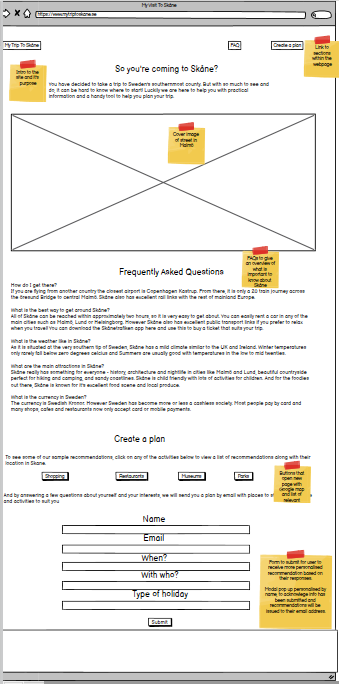
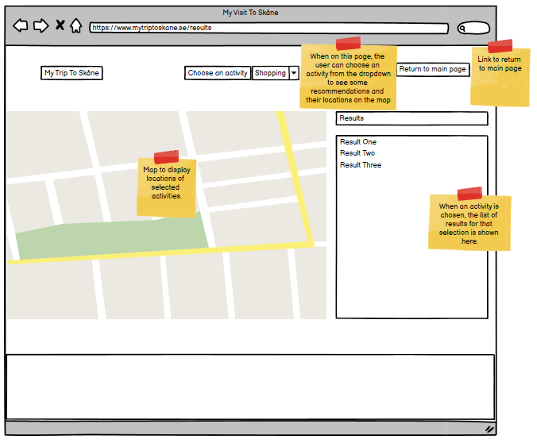
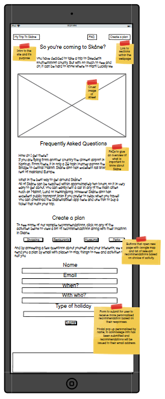
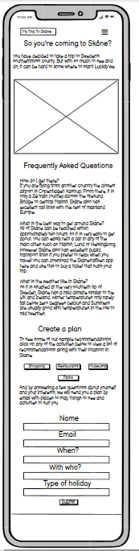
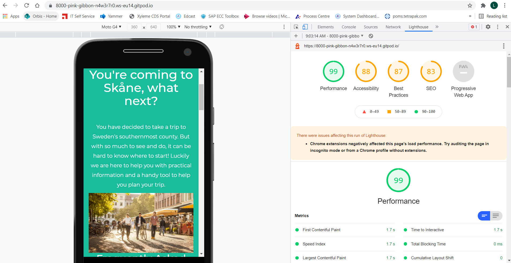

# My Trip to Skåne

## Milestone Project 2 - Interactive Frontend Development

[Visit my website.](https://lorrainehanlon.github.io/my-trip-to-sk-ne-MS2/)

The brief is to build an interactive front-end site using HTML and CSS and Javascript, based on the principles of UX design. This website is for the purposes of this project only.

## UX

### Project Goals
The goal of this site is to help someone who has already decided they want to come to Skåne. THe idea comes from a real world example as I am Irish and moved to Malmö in Skåne over two years ago. I have had different family memebers and friends visit and needed to look for things to do with them, one time it was a couple, another time my brother with his wife and three children.The website aims to give some more information about Skåne and allow the user to request a plan of activities based on their circumstances and interests. It also aims to inspire them by alowwing them to click on an activity type and see a list of suggestions and their locations on the map.  

### User Stories

1. As a first time visiter to Skåne, I want to learn a bit more about it.
2. As someone who has already decided to come to Skåne, I want to get an idea of what activities are available and where they are located.
3. As someone who has already decided to come to Skåne but does not have time to research it, I want a personalised list of possible activities based on my circumstances and preferences.

### Design

#### Typography
I have chosen Montserrat as a clear informative font while also being pleasant to the eye, this site aims to allow the user to quickly take in the information and move to the area of the site they require. 

#### Colour scheme
I wanted the colours to be interesting but not take away from the text content and to match with the colours used in the main image. The white text on green background for FAQ is subtle but still easily read. 

#### Imagery
I chose to have a one hero image of friends walking down a street in Malmö, with bars and cafes in the background. The light is golden, like late summer or early Autumn. The image is inviting and invites the user to think about where those people are going and what they are are planning to do. That should lead the user to think about what they would like to do when they visit Skåne. 

### Wireframes
I created 3 wireframes to display the responsive design of my site.

Desktop Wireframe homepage

 

Desktop Wireframe for results page

 

Tablet Wireframe

 

Mobile Wireframe

 

## Features
I decided to create a two page website with 3. The homepage is the most detailed. It includes and introduction with hero image, a section for FAQs and a section called Create a Plan. The layout leads the user through the site in a logical manner, from the introduction, to more information about Skåne and then the opportunity for them to input what kind of activities they are interested in and would like more information on. 

From the Create a Plan section the user can submit information to have a personalised set of recommendations emailed to them. They can also select one of the activites listed which will lead them to the results page, which shows a list of results for the selected activity along side a map showing their location. From this page they have the option to choose a different activity from the dropdown and an option to return to the main page.

The homepage follows structured layout starting with a header with navbar allowing them to navigate easily to different parts of the site. The navbar includes links to the two main sections. Below the navbar is a shot introduction to the site and an inviting image from Skåne.

The FAQ section quickly gives the user some basic important information that is useful to know before they come to Skåne.

The Create a Plan section gives the user an opportunity to choose from four different activities and be directed to a results page showing them a list of recommendations for the shosen activity and see where they are located on the map. The second part of the Create a Plan section includes a form whwere the user can submit information about themselves and their interests. This is shown for the purposes of the project with a personalised modal confirming receipt of their information and that an email with personalised recommendations will be sent. This could be developed in future to complete the actual email function.

The footer contains site copyright information. 

## Technologies used
* HTML
* CSS
* Bootstrap - started with basic bootstrap template from W3Schools and adjusted to it meet my site vision. Also used snippets from Bootstrap and W3Schools such as modal and form.
* TinyPNG - for compressing images
* Gitpod - used as development environment and for version control
* Github - used to host my code to was created in Gitpod
* Balsamiq- used to create wireframes for desktop, tablet and mobile
* Chrome Developer Tools - used throughout to assess responsiveness and to help with styling
* Google Fonts to assign font to my site
* Free Formatter to beautify CSS
* Minify Code to beautify HTML
* W3C CSS Validation Service to validate CSS code
* W3C HTML Validation Service to validate HTML code
* Lighthouse in Developer Tools to evaluate performance and accessibility

## Testing

### UX stories testing

1. As a first time visiter to Skåne, I want to learn a bit more about it.
* The site guides the user logically and progressively through information about Skåne. From a general introduction to FAQs with good to know information and on to suggestions of activites to do and the opportunity to request more personalised information.
2. As someone who has already decided to come to Skåne, I want to get an idea of what activities are available and where they are located.
* In the Create a Plan section the user has two different opportunities to find out what activities are available. They can click on one of the suggested activities to see a list of results for their choice and a map showing the locations. From the results page they can select different activities from a dropdown to get more recommendations. 
3. As someone who has already decided to come to Skåne but does not have time to research it, I want a personalised list of possible activities based on my circumstances and preferences.
* in the Create a Plan section the user can also fill in the form to receive an email with personalised recommadations of activities they could do along with locations.

### Validation

1. I used W3C CSS Validation Service to validate my CSS code

CSS Validation Results

 

2. I used W3C HTML Validation Service to validate my HTML code 

HTML Validation Results

 

3. I used Lighthouse in Developer Tools to evaluate the performance and accessibility of my site

Lighthouse Performance Results

 

## Deployment

My site is hosted using GitHub, deployed directly from the master branch. 

To run locally, you can clone this repository directly into the editor of your choice by pasting git clone into your terminal. 

To deploy my website I completed the following steps:

1. I clicked on the Settings tab in my GitHub repository.

2. I selected Pages from the sidebar menu and chose the Master branch as the source to enable GitHub Pages.

3. I then clicked Save and the URL to the live site was generated.

4. I then followed the link to observe and verify the published GitHub page. 

## Credits 

### Content
Text content all original by me with some of the basic information found on the Visit Skåne website - visitskane.com. 

### Media
Main image from Visit Skåne website - visitskane.com.

